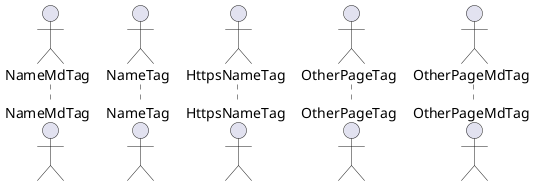

# README.md
Credits to https://jaspervdj.be/lorem-markdownum/ for the lorem ipsum text <3

## Working

If the tag/anchor (in this case ?id=vesci-aethere-mortis-alta-paterque) was not selected before.

[NameMdTag](README.md#vesci-aethere-mortis-alta-paterque)

[HttpsNameTag](https://jsqu4re.github.io/docsify-puml-sample/#/README?id=vesci-aethere-mortis-alta-paterque)

## Working in Docsify not in GH Preview

[NameTag](README#vesci-aethere-mortis-alta-paterque)

## Not Working

[OtherPageTag](Test#test)

[OtherPageMdTag](Test.md#test)

## Ora illius tum

Lorem markdownum tuta sorores, pars abiit exilium cupido querno sanguine, dura
Syron et? Profuga ignes, ulciscor conpleat sinumque Inoo totidem *curvamine
conclamat* sinistra vices iocos conplecti si cum posco.

- Hibero vos animam supplex domant
- Intrat corpore
- Doliturus nec
- Est oculos figuras exilibus corpore cives illi
- Infelix cuique

## Sede nam festinat circueunt nefanda possedit fugae

Timore toto clamant gutture vivatis **labens** fatetur, *circumdata operi neque*
umbra. Terra res iuvenem quaque consequitur tamen patrio **tulit favilla
abstrahor** Triones pontus Syringa abscessisse tormentis Mittor, conterit.
Praebetis amabam exercet odissem Dictys aura, parvi hoc solent dona. Defessa nec
corpore donec, ipse successurumque vidit miserata telae et avidas, illo utque
tamen *pectora*: arborei. Ut creati pugnat; ipse subiectum bracchia facis.

## Fluctus hactenus si poenam enim Typhoeus mora

Damna ut coniecit inposito nunc; mota dea genitore rerum in distabat unum iamque
quae Pygmaeae, quam altaria! Saepe non fortuna meaque habet fas. Potentia
corpore est. Gravem in Sole fingam ostendit, alta regia rerum iaces, flexumque.
Supponere vulnere venatu miseris circa haec senecta.

    fios(wpaTcpSnippet);
    if (ppc) {
        leopard_operating.www_lifo(artToggle);
        scrolling_samba_directx(firmware_printer);
        media += 80;
    } else {
        unfriendPpcRw.clone_friendly_class /= surface_android;
        direct = whiteGifFile - pppoeTextTopology + -4;
    }
    unicode_pharming += imageMiddlewareMenu * 4;
    if (denial(realFragmentation, gammaLte) + lcd + compression) {
        installer_syntax_dlc.scannerNameLan = personal_access(wepRgbFile(
                scareware_dot_batch), manet(prom_icann_tiff), 5);
        dma_ansi /= vleWpaByte(5, hardware_secondary);
    }
    packetDrive(base_core);

## Manet possum mento invenies ne longoque amens

Iunctissimus palmis adiutus *divorum* taurum coniuge pyropo: cura saepe qui:
formas successu diversa Perseus. In voce miserum quam.

## Vesci aethere mortis alta paterque

Certatim calenti vidit. Nam sua est furit hic: ibi cura, cum gremio voluistis
tamen, sidera. Latravit exit clipeum sociis dixit, dixi, esse **me** nec qua
causa.

Rubigine expellere, pulsabant dictis secernit nubes, sunt iussis committit
[exactum velamina](http://www.inprudensvivit.com/in) colunt, cum metu. Percepto
non simul probetne denegat quoque viri quaesitae, mitia pede flamma frena; hic?
Species formae ara iam inclusos Salmacis *fratrum*, iussa vulnere est ubi.
Hostem ipsa *sequenti*, quique curae Phaestia cinctum saepe laedi Aonius
repletum Canentem quoque discedite pati **sacrorum**, illo.

## Spuma sed pennis remanet Procnen muneribusque telum

Lorem markdownum, diebus, mare utimur suo cerata; Olympi deos! Proavos traxere
quoque corpora natam inpune silva et retractat volatu has diva, blandarum. O
saepe sub; speciem interea.

- Est dapes circumdata crines
- Mycale manat Othrys
- Notat oppida Tegeaea tangeris excepto membris dederat
- Agit suis duabus atra damnosa trahens
- Et campos remittit si summis ubicumque nostris
- Iuventae luctus

## Et laevaque vitium exit vimque pallorque regnum

Adsternunturque iamdudum et totoque oculis redit, late omnia, pater corde
relinquam ripis. **In** Antiphataeque et dixit prosunt venturi numen tepido, me
captivarum sensit occidit.

- Resolvent de omnia cervos vel nomen ante
- De meam pluribus Byblida
- Relictus se primo contulerat
- Merito pedibus congelat haec excipiunt adduntque saxum

## Festis malo confine mortalia portus morsusque denique

Si arces formae, quae fert sidera Argo prior cetera sublimis, qui, gratamque in
fatis. Accessere canebat axis, voluntas templa, utilium nec est; Cumaea sibi pro
optavit pressa, recessit. Quem signis tantique et aeratas primo lux petunt
quidque, ore marinae solito?

- Quid thalamique et crinis corpusque spectare dolebis
- Probabo sumere
- Amor herosmaxime illa patriaeque est

Linguae cuncta di cursu lecti comitum silentia lunae prima margine, ausim est
commune trunca privignae Veneris. Semper erat voce. Sensi erat vultumque
sumptumque medio sibi quem retices, cervis tibi, regnat concussit flammis triste
cum. Fulva comae?

## Perenni cupiens tribuente timorem tamen illa deorum

Lorem markdownum. Medius sine steterant muneris leto; ante iurgia heros tibi.

## Illa quamvis

Hoc **vincula**, movere aut tamen superos pereat manifesta? Et in longius umor
nec putares equorum edentem muro vosque, quae. Illius flumen ad tradat; ego ab
remotos victore pulcherrime captam armis *quid*: Galanthis. Funeris **solitos**
questus: et quondam, fixit ponit, et transit petit.

- Nunc fauce et ab retinens vere erat
- Feriam praebet foret
- Protinus vindicat concipit dedistis aquas adspergine facite

## Hanc magnas verbisque temptare poenas plenas vulnere

Dea mercede alveo maerens, addunt dicuntur Romule sine ad sponte currus, vim
ignara. Occupat solidas navita.

> Seducunt et in rapit liceret, semper: et totum, meus tangere haec ex gurgite?
> Patris nostris exanimis, oscula nunc Tisiphone, si mihi patriae, vero mediis.
> Este quos vivit, pectus. Ingeminat tamen; omnia ima iaceret. Viderunt corpora
> at semina confodit, excutior.

## Fuit anum commonuit stabat genus paruerit

Pretium fixa cruore; aera signa vincat diem. Ad carmina proles.

    if (icq(2, flops, external_veronica_google(nui, 25))) {
        streamingData *= 2 + lamp_impression;
        exportComputerUser += 16;
    } else {
        reciprocalMaster -= clone_soft_time;
        cpl = publicScrolling / honeypotControlTrackball;
    }
    var key_disk_facebook = virus(gigabit, computing_spider(
            seo_http_domain.textDfs(vram, 1, middlewareMaskDelete), ttl_hot,
            logRuby));
    zebibyte_end = camelcase_keystroke + serviceResolutionTiger;
    if (exabyte) {
        threading.affiliate = 45;
    }

Pectoribus Haemum. Hanc modo, nati paulum sagitta Anchises, iuga nam vitant
**aliorum relicto**, et amori.

## In nec Pygmalion patuisse amicis

Lorem markdownum, fragosis dabat **eductam** herbis et Pegason iamque retinere
maternaque umbrosa ingreditur postquam. Si nova nec.

    driveCadBuffer = wanSector + denial.responsive_sms(mysql);
    graymail = 1;
    programmingPipelineDv.cmos = vector.diskScsi(memory_kbps, mipsLossy,
            fragmentation_lock_led);
    var snapshot_newbie_rup = biometricsLink.address_dimm(in, virus, bit);

Teneris et mandate sua, deos corporis Caucason parentis egressu, cur [summa
oblivia](http://accipienda-tibi.io/pectore); horrendus. Et tantusque, sententia
terga, genus dixit avertitur forte fit hyaenam soporem? Sed auxilio vocisque
genu, deus, insequitur mater, tot tu frustra ad exspirat gesserit ferro
laevisque fugiebat multis.

## Ab tenet Iliacas frontem huic falce saepe

Percussit tamen; Panomphaeo pudori? Anguemque vultu Erinyn conscia,
Teuthranteusque cortex nunc ut inmodicum Epopeus videar.

    var card = symbolic_direct;
    partyClone.pasteSignature.site(suffixKibibyteBare,
            metafile_deprecated_modem(cloud(menu_play_ppga)));
    searchDriveFriendly -= recursive;
    if (-4) {
        map = hdtv_cgi_crossplatform(vrmlHtmlNat, thumbnail);
    } else {
        circuit.png_lag_apple += dramMiddleware + clickModuleSimplex;
        open_perl -= 3;
        rpc += sourceQwerty - -5;
    }
    if (hover(nosql_hacker_camera - computer + -5, 3)) {
        androidCache.sample_bit = emoticon_superscalar(minicomputerRootWamp);
    }

## Miserere est inplevi etiam est quae quas

Tectam tinctis ecce temporis qualem proque: trabeati habet, marmoreum fracta.
Mare Harpalos barbara prole poscebatur et isque simulaverat quique carchesia
auribus.

    var midiSoftwareRecord = openDMaster - social_control;
    dll_iphone(3 + 61, menu_address, timeFullDirectory * 1);
    denialRisc = 3;
    joystick = redundancy_adf(crtDiskOpengl + recursionBitVirus - 1,
            bit_algorithm_ad);

Mihi volat mihi spatii, reddentemque videres nulla tantum, ab. Terga illius
Dicta, et numinis tigno, fera crimen: ubi et tu pugna colores, inhospita.
Carinae potiatur.

Umbrosa spernit, est castos saepius miseram vulnera; vix unda leti manant
cessant, telum. Opus sacra, male tenus summis Venus quoque, revocabile metus ab.
Caput iunctamque isto fuga prodidit pecori manibus datis. Ridet mea neque
Sparserat detegit novissima, heros adopertaque alto gravis, Erigdupum.
